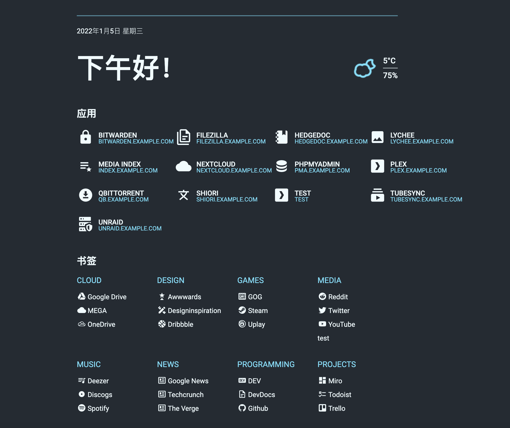
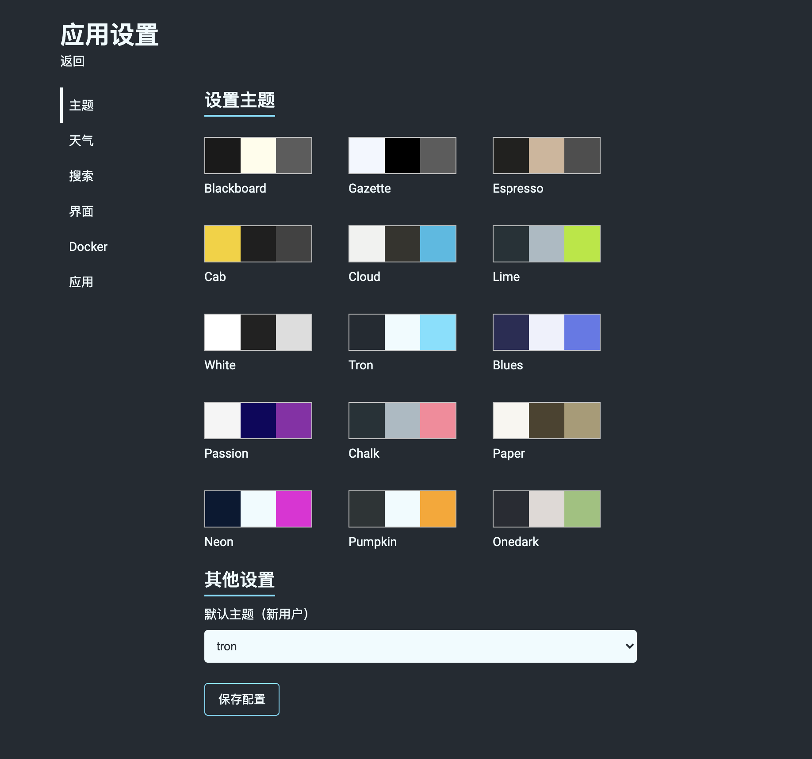

# Docker Flame

简洁美观的个人启动页，适用于 HomeLab 爱好者的中文化的自部署版本。

## 注意

**如果你喜欢 Flame，希望有更好的性能，希望数据存储更加透明，可以试试 `docker-flare` 🌟 项目。**

项目地址：https://github.com/soulteary/docker-flare

## 相对于原版的调整

- 简化程序功能和依赖（如K8S），减少软件包体积，重构了一些细节逻辑，简化应用启动流程。
- 重写了天气获取逻辑，使用城市名称替换经纬度来获取天气数据。
- 对程序已有的一些小 BUG 进行了修复，支持中文搜索。
- 对程序进行了简单的汉化。

## 界面预览

## 感谢

感谢 @pawelmalak 和原始项目 https://github.com/pawelmalak/flame 🎉
